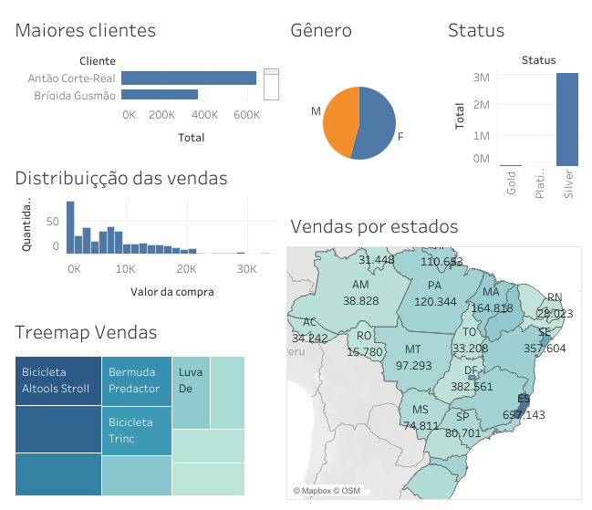
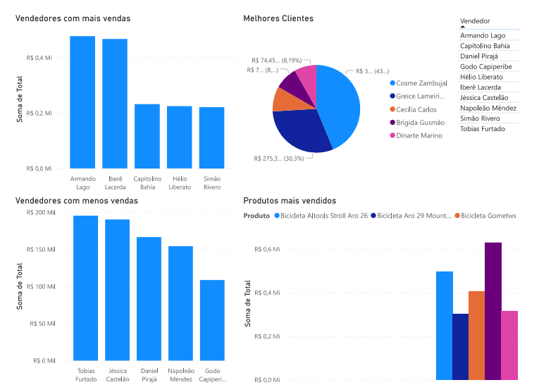

# DataAnalytics
Data analysis course provided by Fernando Amaral with topics such as data cleaning, statistics, machine learning, neural networks, database, dashboards, and others.
All practices and the final project were written using the Python language, in addition to dashboards produced by Power BI and Tableau. 

- [x] **Data Analytics with Python - Final Project**  

- [x] **Excel & Tableau**  
From a database with customers, sellers, sales, and products, it was possible to find information such as: states with the highest number of purchases, customers who spent the most, predominant gender and status, best-selling products and the amount of products sold by price. 
*See on Tableau Public:* **[Dashboard](https://public.tableau.com/app/profile/jo.o.eduardo.alvarenga.pinto/viz/Vendas_16806465853940/Painel1)** 

 

- [x] **Excel & Microsoft BI**  
From a database with customers, sellers, price, products, and units it was possible to find information such as: total sales of products per year, best and worst sellers, best customers, best-selling products, and also iterative research including these characteristics. 
*See on PowerBI :* **[Dashboard](https://app.powerbi.com/view?r=eyJrIjoiZTU2ZmI0MzUtMzljNC00MTdjLTgxOGItNDUxMjRjMDJmZWRlIiwidCI6ImZlODc4N2JjLWM5MTQtNDY2NS04NTQ3LTI2OGUxNWNiMGQ5YSJ9)** 

 
